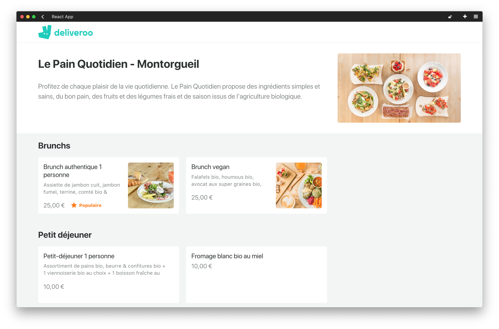

# Module : React

`Jour 6 & 7`

## Deliveroo

### URL.s

My React App : 

My BackEnd : 

Demo: 

### RoadMap

- 1/ Nous allons commencer par afficher la liste des menus sur la page.
- 2/ Nous nous concentrerons donc uniquement sur la mise en place de la récupération des données de l'API et de la feuille de styles.

### Consigne

- [x] Le code source devra être hébergé sur GitHub.
- [x] Vous devrez créer un projet React et l'héberger sur Netlify.
- [ ] Vous devrez récupérer les données de votre API grâce à `useEffect` et à `Axios`.

### Resultat attendu

